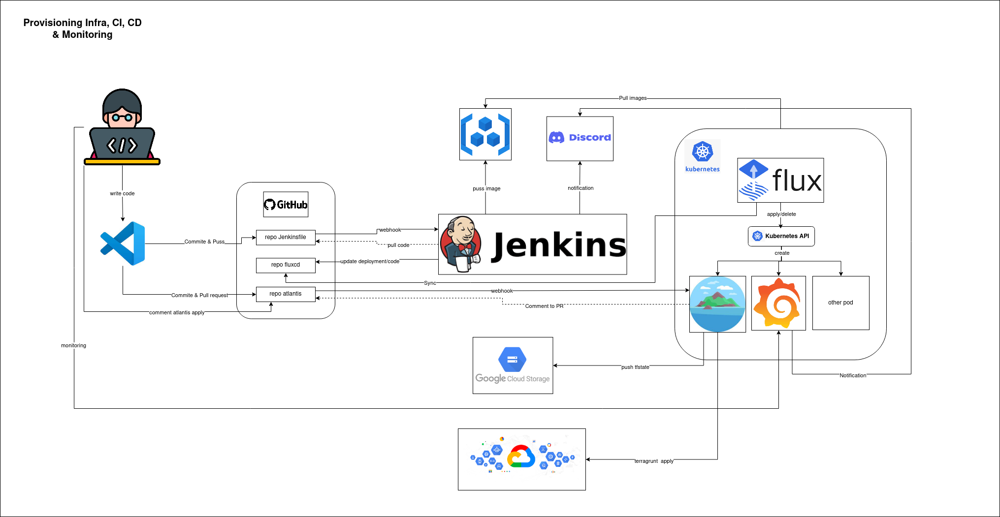

# provisioning-infra-CI-CD-monitoring


## Procurement

* [Ansible](https://docs.ansible.com/ansible/latest/installation_guide/index.html)
* [Terraform](https://developer.hashicorp.com/terraform/tutorials/aws-get-started/install-cli)
* [Helm-chart]()
* [Google-cloud-CLI]()

```bash
pip install foobar
```

## Installation

### Jenkins
* provisioning instance with terraform
```bash
ubuntu@oem:~/installation/jenkins/terraform$ terraform init
ubuntu@oem:~/installation/jenkins/terraform$ terraform plan
ubuntu@oem:~/installation/jenkins/terraform$ terraform apply
```
* configure instance with ansible playbook
```bash
ubuntu@oem:~/installation/jenkins/ansible$ ansible-playbook -i inventory playbook.yaml
```
* configure jenkins can be customized by jenkinsfile in datasource folder

### FluxCD
* connect to gke with CLI
```bash
$ gcloud container clusters get-credentials foo
```
* configure FluxCD
```bash
$ export GITHUB_TOKEN=foo
$ flux bootstrap github \
  --components-extra=image-reflector-controller,image-automation-controller \
  --owner=dimaswiryatari \
  --repository=fluxcd-porto \
  --branch=main \
  --path=clusters/fluxcd \
  --read-write-key \
  --personal
```
* atlantis, monitoring app, inggress and other app can configure by push data source fluxcd to repo fluxcd. 
